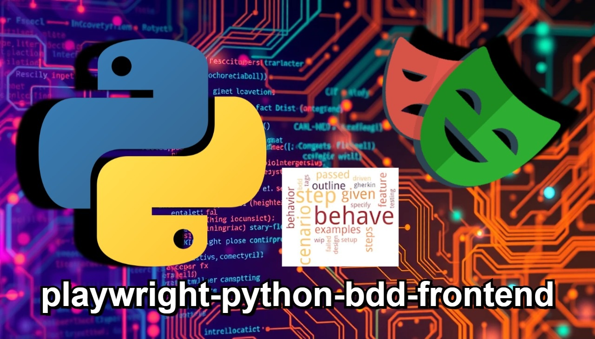

  

# 📑Information about this repository (for recruiters)

## 📄Description

### 🙋‍♂️Introduction

Welcome to my repository, recruiters.  
Feel free to review its contents at your convenience.  
I'm a **software tester** and I created this repository to learn how to write **Frontend/UI tests** using `Python`
and the `Playwright` framework using the `BDD` (Behavior-driven development) methodology by using `pytest-bdd`.

### 📦About repository

- This repository contains **Frontend/UI tests** using `Python`, `Playwright` and `pytest-bdd`
- Here are tests of a website called [**Automation Test Store**](https://automationteststore.com/),
  which simulates an online store with its behavior
- A list of things I learned are in the later sections of this document.

### 📌Additional notes

- Some of the comments in the repository are in Polish, so that when I come back to it, I can more easily remember and
understand what a given piece of code was about.
- There are also comments in English to explain to you (recruiters) what a given piece of code is about and why I wrote
a certain method/test this way and not another.

### 🫵Note for recruiters

- If any tests seem incomplete or outdated it may mean that the developers may have changed something over time,
  and it's different from what I wrote the tests for.

## 🌐Website covered with tests

[**Automation Test Store**](https://automationteststore.com/) – a website simulating an online store.

## 📊Test Statistics 🔴TODO

I know I could do more, but I also don't want to stay on this project too long because I also want to do other things.

### Summary

| Tests type | Quantity | Average execution time |
|------------|----------|------------------------|
| UI         | ???      | ??.??s                 |

### Details (tests structure) 🔴TODO

(🔴TODO: Tests tree)

### Coverage and page/area documentation

(🔴TODO: Add links to test documentation)

## 🧰Frameworks and technologies used 🔴TODO

### General

### Frontend (UI tests)

### Tests

## 🎯What I learned and what I practiced 🔴TODO

### General

### Project

### Python

### Tests

### UI tests (Frontend)

## ️▶️How to run tests 🔴TODO

### Prerequisites

### Steps

### Run via IDE

### Run via Console

## 🖼️Screenshots from project 🔴TODO

